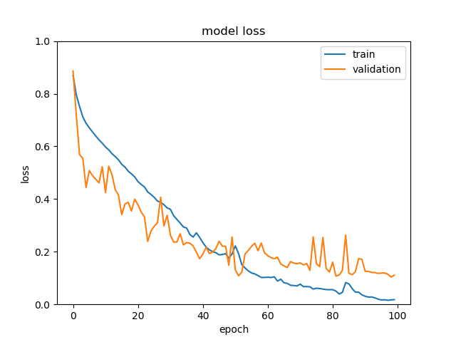
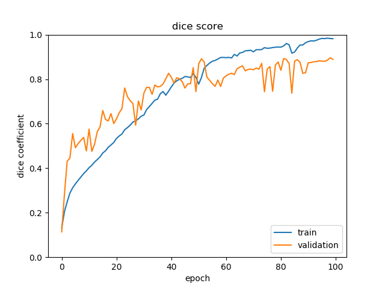
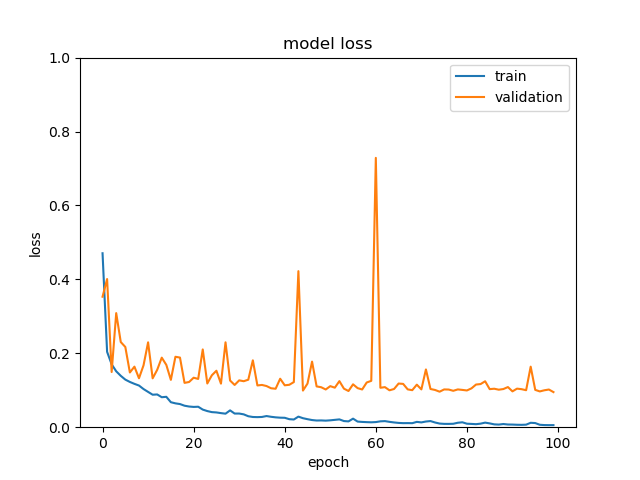
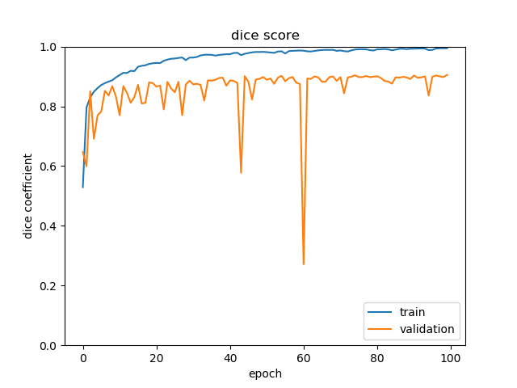

# 3D Transformer-based UNet-like and VNet-like architecture - Keras

*NIH-82** - *"3D Convolutional Neural Network for colon Segmentation"*

Intestinal segmentation project, which may be used for tumor prediction.

At present, the project has completed the development and debugging of 3DUNet and 3DVNet(GeoVNet) model, and the model performance is shown in the diagram in the project.
About 1000 intestinal CT data are used in the project. 

Computational conformal geometry algorithm is used to annotate the data, and then supervised model training is used to solve the problem of image annotation difficulty in medical image processing, and its effect is proved to be better than the traditional geometric segmentation method.

This project was run in ubuntu18.04, NVIDIA GTX 2080Ti environment.

## Requirements
* Tensorflow-gpu == 1.14.0
* Python == 3.7.3
* conda == 4.11.0
* keras == 3.5.5
* numpy == 1.18.1
* scikit-image == 0.17.2
* simpleitk == 2.1.1.2
* cudatoolkit == 10.1.243
* cudnn == 7.6.5
* cupy-cuda101 == 9.6.0(if gpu pre-processing possible)

## Scripts
### data preprocessing
*  DataUnzipping.py -- unzipping raw data
*  DataResampling.py -- dataresampling to size of 128,128,128(or any other size to fit the model)
### U-Net model
*  3DUNet.py  -- model training
*  ModelPrediction.py -- generating reconstruction result for visualization
### V-Net(GeoVNet) model (./VNet-master)
*  3DVNet.py  -- model training
*  Vnet_3d.py -- V-Net model
*  ModelPrediction.py -- generating reconstruction result for visualization

## Model Results
### 3D U-Net Architecture loss:

#### We achieved a dice score of 0.90 with this architecture.
#### This is our second best model.

### Results

### 3D V-Net(GeoVNet) Architecture loss:

#### We achieved a dice score of 0.89 with this, but with high resolution and reconstruction performance on z axis.

### Results 

# What I Learned & detailed presentation
* Presentation PPT : [PPT](https://github.com/JimCui0508/3D-colon-segmentation-project/blob/main/3DU-net%20segmentation(1).pptx)
* Automatic pre-processing algorithm Medical Images in the NIfTI format with simpleitk, scikit-image.
* Successfully adapted [VNet](https://arxiv.org/abs/1606.04797 "V-Net: Fully Convolutional Neural Networks for Volumetric Medical Image Segmentation") (3D CNN Architecture) to Tensorflow/Keras.

# Models that are under development(completed)
* 3D Shifted WINdow Transformer UNet(Using transformer block as bottleneck)
* Dual attention Vnet(from junqiangchen) [original idea](https://github.com/junqiangchen/VNetFamily)
